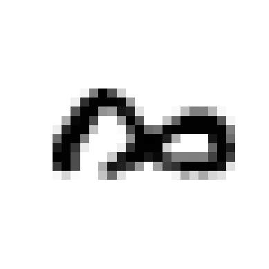

# 手写数字识别

## 项目概述

本项目基于 MNIST 手写数字数据集，构建并对比了多种分类模型，最终以核 SVM 为主力模型，通过网格搜索调参，在测试集上取得了 **94%** 的准确率。报告涵盖数据预处理、模型训练、模型对比、超参数调优与结果评估的完整流程。

---

## 数据

### 数据集描述

该数据集包含 10 个类别（数字 0 到 9），共 4000 张图像（每类 400 张）。每个特征向量是向量化的图像（784 维），包含灰度值 [0, 255]。原始图像尺寸为 28×28。



### 数据预处理

**1. 归一化：极差标准化方法**

将像素值从 [0, 255] 缩放到 [0, 1]：

```python
# 归一化，将像素值从 [0,255] 缩放到 [0,1]
X_minmax = X / 255.0
X_minmax.shape
```

**2. 数据降维：PCA 主成分分析法**

```python
# 主成分分析
pca = PCA(n_components=0.95)  # 保留方差比为 95% 的主成分
X_pca = pca.fit_transform(X_minmax)
X_pca.shape  # 最终将 784 个特征保留到 147 个
```

> 对于 MNIST 数据集，降维之后，每个实例的 784 个特征会减少为 150 多个，在保留了绝大部分差异性的同时进行了合理压缩，提升了算法速度。

---

## 方法

### 使用的算法

| 算法 | 思想 |
|---|---|
| 贝叶斯分类器 | 基于贝叶斯分布 |
| 支持向量机 | 用一条线划定决策边界 |
| 逻辑回归 | 输出类别的概率 |
| 感知机 | 由误分类驱动更新权重，找到线性决策边界 |
| 最邻近 | 基准分类器，作为衡量标准对比效果 |

### 训练模型

在训练集上训练模型。主力模型为 **核 SVM**，可用一对多策略；基准模型为 **最邻近**。

> **一对多策略（OvA）**：为每个数字训练 1 个分类器，总共 10 个分类器。当需要对一张图片（784 个像素值）进行检测分类时，获取每个分类器的决策分数，哪个分类器给分最高，就将其分为哪个类。

**基准模型示例**

```python
# KNN (Baseline)
from sklearn.neighbors import KNeighborsClassifier
from sklearn.linear_model import LogisticRegression

knn = KNeighborsClassifier(n_neighbors=3)
knn.fit(X_train, y_train)
print(f"KNN准确率: {knn.score(X_test, y_test):.4f}")

lr = LogisticRegression(max_iter=1000)
lr.fit(X_train, y_train)
print(f"Logistic回归准确率: {lr.score(X_test, y_test):.4f}")
```

**核 SVM 模型**

```python
# SVC (RBF)，使用 PCA 降维后的数据
svc_model = svm.SVC(
    kernel='rbf',      # 径向基核函数
    C=10,              # 正则化参数
    gamma='scale',     # 核函数系数
    decision_function_shape='ovo',
    random_state=42
)

svc_model.fit(X_train_pca, y_train)
y_pred = svc_model.predict(X_test_pca)

# 准确率
accuracy = accuracy_score(y_test, y_pred)
print(f"核SVC准确率: {accuracy:.4f} ({accuracy*100:.2f}%)")
```

### 模型对比筛选

（此处可补充各模型在测试集上的准确率对比表，例如 KNN、逻辑回归、核 SVM 的准确率并列展示。）

### 调参

```python
# SVC 调参
param_grid = {
    'C': [0.01, 0.1, 1, 5, 10, 100],
    'gamma': [0.001, 0.005, 0.01, 0.05, 0.5, 1, 5, 10],
    'kernel': ['rbf']
}

grid_search = GridSearchCV(
    svm.SVC(random_state=42),
    param_grid,
    cv=5,
    scoring='accuracy',
    n_jobs=-1,
    verbose=1
)
grid_search.fit(X_train, y_train)

# 输出最佳参数和准确率
print(f"最佳参数: {grid_search.best_params_}")
print(f"最佳CV得分: {grid_search.best_score_:.4f}")

# 测试
best_svc = grid_search.best_estimator_
accuracy = best_svc.score(X_test, y_test)
print(f"测试集准确率: {accuracy:.4f}")
```

在训练集上，使用 5 折交叉验证调整超参数：`C`（正则化参数）和 RBF kernel width。由于有两个参数，可使用网格搜索（Grid Search）来寻找最优配对，使得交叉验证精确率最高。

---

## 结果

### 模型评估

在测试集上预测数字，使用混淆矩阵，计算每个数字的精确率、准确率、召回率和 F1 分数。


```text
        Number     precision    recall  f1-score   support

         0       0.99      0.96      0.98       200
         1       0.97      0.97      0.97       200
         2       0.89      0.94      0.91       200
         3       0.93      0.93      0.93       200
         4       0.93      0.93      0.93       200
         5       0.93      0.94      0.94       200
         6       0.96      0.96      0.96       200
         7       0.97      0.94      0.95       200
         8       0.94      0.94      0.94       200
         9       0.94      0.93      0.93       200

    accuracy                           0.94      2000
   macro avg       0.95      0.94      0.94      2000
weighted avg       0.95      0.94      0.94      2000
```

### 结论与改进方向

模型在数字识别任务上整体表现良好，宏平均 F1 分数达到 **0.94**。
其中，数字 0、1、6 的识别效果最佳（F1 > 0.96），而数字 2 的识别效果相对较差（F1 = 0.91），主要表现为精确率偏低（0.89），表明部分其他数字被误判为 2。

建议后续通过增加数字 2 的训练样本，或针对 2 与其他数字的混淆对进行特征优化，来改进模型性能。